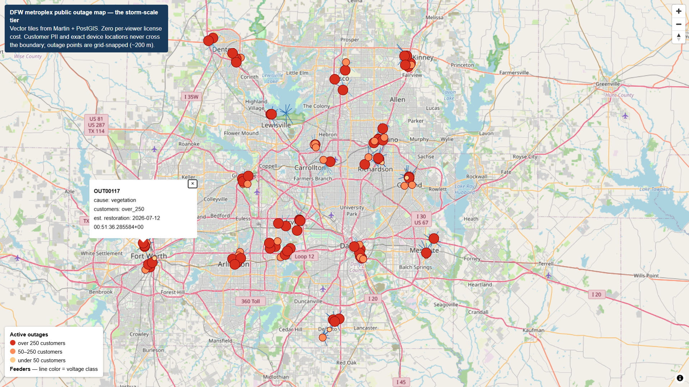

# Hybrid Enterprise GIS Reference Architecture — Electric Utility Network


**ArcGIS Enterprise (Utility Network) as the system of record. Open-source for
public outage delivery. OGC standards as the only contract between them.**

This repo is the open-source half of a hybrid enterprise GIS for an electric
distribution utility, plus the architecture documentation for the whole system.
The documentation is the product; the running stack is the evidence.



## Why this architecture

Network editors, engineers, and OMS integrations need the Utility Network,
versioned editing, and the Esri toolchain — that's what the license buys.
The **public outage map** is the opposite workload: anonymous, read-only, and
storm-driven — a major weather event can send six figures of concurrent viewers
overnight. Sizing Esri per-viewer delivery for that spike is exactly the wrong
economics. So: the authoritative network lives in the Enterprise geodatabase,
a sync materializes public-safe layers into PostGIS, and open-source
infrastructure serves them as vector tiles at zero marginal license cost.

What never crosses the boundary: customer PII (service points), exact device
locations (CEII-adjacent), crew notes, precise customer counts. Outage points
are snapped to a ~200 m grid. The boundary is enforced in SQL — see ADR-005.

## Repo layout

```
hybrid-gis-architecture/
├── docker-compose.yml      # the open-source half, one command to run
├── GUIDE.md                # step-by-step build instructions, start here
├── .github/workflows/      # CI: real PostGIS, init SQL, boundary + ADR-008 regression tests
├── analytics/              # R: the analyst persona consuming the same platform
├── db/init/                # schema, synthetic network, public-safe views (auto-run on first boot)
├── sync/                   # utility network -> PostGIS sync script
├── web/                    # public MapLibre outage map
├── docs/
│   ├── architecture.md     # system diagram, data flow, trust boundary
│   ├── adr/                # ADR-001 .. ADR-008 (the tradeoff decisions)
│   ├── enterprise-deployment.md  # open-source -> ArcGIS Enterprise translation + install order
│   └── operations.md       # incident runbook (symptom -> diagnosis -> fix -> rule)
└── k8s/                    # illustrative Kubernetes manifests
```

## Quickstart

```bash
docker compose up -d
# PostGIS   -> localhost:5432  (gis / gis_dev_password, db: public_gis)
# Martin    -> http://localhost:3000       (tile catalog: /catalog)
# GeoServer -> http://localhost:8085/geoserver  (admin / geoserver)
# Keycloak  -> http://localhost:8081       (admin / admin_dev_password)
# Outage map-> http://localhost:8088
```

A synthetic DFW-metroplex distribution network loads on first boot:
32 substations clustered around 16 real urban anchors (Dallas, Fort Worth,
Arlington, Plano, ...), 320 feeders, 1,600 devices, 4,800 service points,
and 120 outages. Open http://localhost:8088:
feeders colored by voltage class, active outages sized by customers affected.

## Evidence

- **The trust boundary, visible:** the same outage in the AGOL source layer
  (crew notes present) and the public view (crew notes gone) —
  [boundary-two-views](docs/img/boundary-two-views.png). Enforced again at the
  database: GeoServer's service account can see exactly two layers and nothing
  else — [geoserver-boundary-layerlist](docs/img/geoserver-boundary-layerlist.png).
- **Standards interop:** one QGIS project consuming the open-source WFS and
  Esri's cloud REST simultaneously — [interop-qgis](docs/img/interop-qgis.png)
  (full matrix in [docs/interop.md](docs/interop.md)).
- **The analyst persona:** R reading the same PostGIS the tile servers use —
  [analytics-outage-map](docs/img/analytics-outage-map.png).

## The one-sentence pitch

> "I architect on ArcGIS Enterprise, and I know when and how to bridge to
> open-source to solve problems Esri alone can't — or shouldn't — solve."

Dev credentials are intentionally trivial; this is a reference design, not a
hardened deployment. See ADR-005 for the security model.
