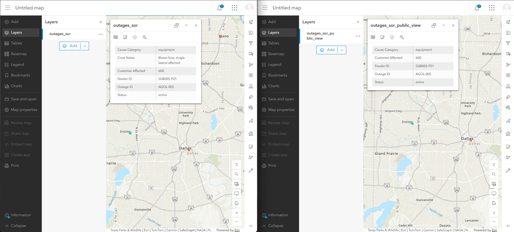
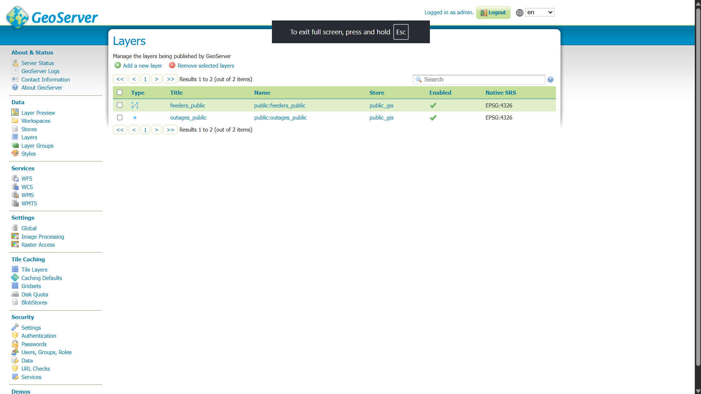

# ADR-005: Security model — the boundary is enforced in SQL

Status: Accepted

## Context
Utility data carries two distinct sensitivities: customer PII (service points,
accounts, names) and CEII-adjacent infrastructure detail (exact device
locations, switching configuration, crew operations). A boundary enforced only
in application code is one bug away from a breach of either.

## Decision
- Only feeders_public and outages_public are readable by the public tier.
- service_points and devices have NO public projection at all.
- crew_notes never leaves sor; customer counts are banded; outage locations
  are snapped to a ~200 m grid (ST_SnapToGrid); feeder geometry is simplified.
- Tile servers connect as tile_reader, granted SELECT on the two views only.
- Internal auth stays in Portal (named users). Public tiles are anonymous-read.
  Keycloak exists solely for future authenticated functions (e.g. crew view).
- Dev credentials in this repo are placeholders; production uses a secrets
  manager and TLS termination at a proxy/CDN in front of Martin.

## Consequences
+ Defense in depth: a compromised tile server cannot read PII or exact
  device locations — the role has no path to them.
+ Clear, auditable answer to "how do you know nothing sensitive leaks?"
- Adding a public field requires a view migration (accepted: that friction is
  the control working).

## Evidence (post-implementation)

The same outage (AGOL-005) viewed through the source layer — crew notes,
exact customer count — and through the public view, where crew_notes does
not exist as a field. Below: GeoServer, connected as svc_geoserver, can
enumerate exactly two publishable layers; sor.* is not merely hidden, it is
unreachable for that role.

