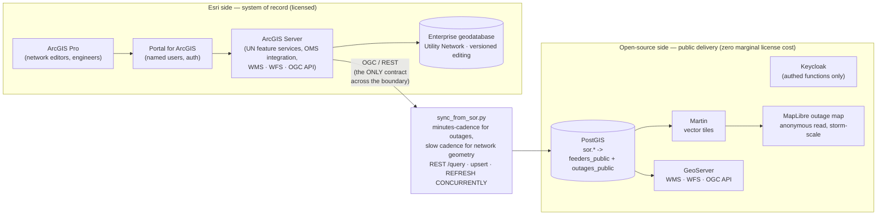

# System Architecture — Electric Utility Hybrid GIS

## Diagram

## Trust boundary

Everything left of the sync is authoritative and access-controlled by Portal.
Everything right of it is a derived, read-only, public-safe projection:

- **Customer PII** (`sor.service_points`: names, accounts) never crosses.
- **Exact device locations** (CEII-adjacent) never cross; outage points are
  snapped to a ~200 m grid (`ST_SnapToGrid`).
- **crew_notes** never cross; **customer counts** are banded.
- Feeder geometry is simplified before serving.
- Tile servers connect as `tile_reader`, a role that can only SELECT the two
  public views. The boundary is enforced in SQL, not just convention.
- Geometry columns in the public views carry explicit `::geometry(Type, SRID)`
  casts — a hard requirement of Martin's auto-discovery (ADR-008, OPS-001).

## Data flow

1. Network editors maintain the Utility Network in the Enterprise geodatabase;
   the OMS writes outage events. Authorized operations staff monitor the
   authoritative (unredacted) data through internal ArcGIS Dashboards —
   crew notes and exact counts included — while the public sees only the
   redacted projection (see docs/ops-dashboard-spec.md, ADR-005).
2. `sync/sync_from_sor.py` runs on a minutes-cadence for outages (slow cadence
   for network geometry): pages the feature service REST API, upserts into
   `sor.*`, logs to `sor.sync_log`, refreshes both public views concurrently.
3. Martin serves the views as vector tiles; GeoServer exposes the same data
   over WMS/WFS/OGC API where a standards surface is needed.
4. The public outage map is anonymous-read MapLibre. During a storm, the tile
   tier scales horizontally (and behind a CDN) — public load never touches the
   system of record. Internal users never leave the Esri stack.

## Why each side is where it is

Network editing, tracing, versioning, and OMS integration stay on Esri because
that is what the Utility Network license buys. Public outage delivery moves to
open-source because storm-driven viewer spikes scale with weather, not with
staffing — per-viewer licensing is the wrong cost model for that curve. The
OGC/REST contract keeps either side replaceable — see the ADRs.
